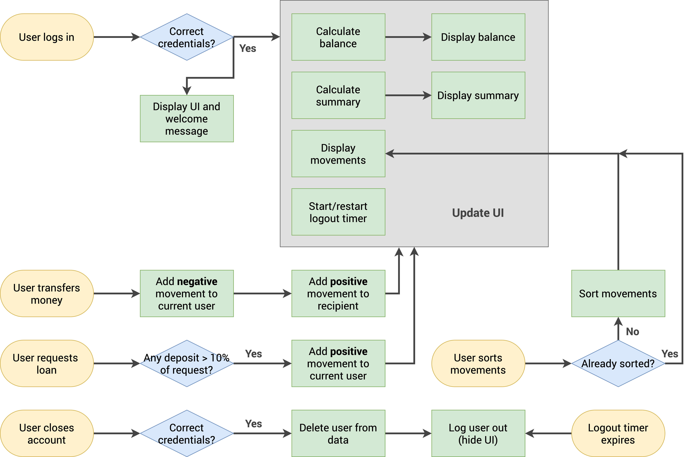
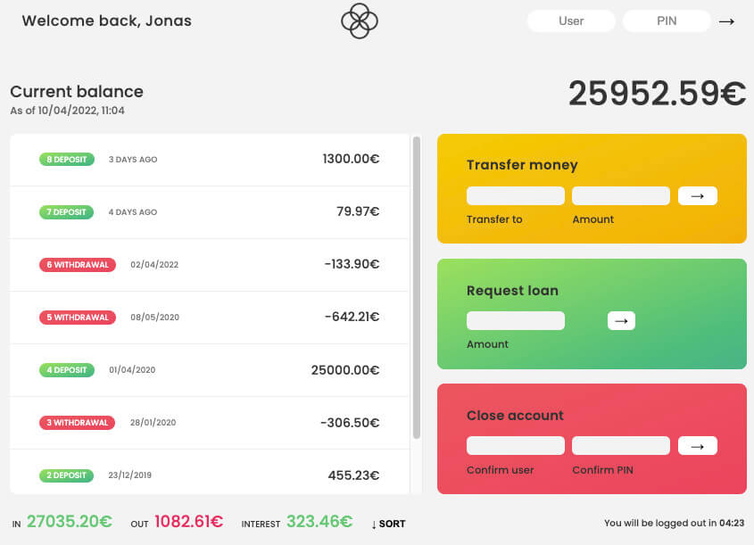

# What is this program and how does it work?

### This program was not invented by me. This program was written as part of a course on Java Script, studying its theoretical part related to arrays.

#

### This program works well on large screens, it is **not** adapted for mobile devices, since adaptation was not the goal of writing it. Details about all the methods studied are in the JavaScript-theory directory. Of course, it is impossible to memorize all these methods, but understanding HOW they work and when and which method to use is fundamental.

#

### However, I made some **changes** to this program:

- HTML markup uses BEM technology.
- Using SASS as the main style writing model
- Using native CSS variables
- Slightly changed the style of writing functions in JavaScript code

#

## Here is the algorithm of the program

### When the web-page loads, only the input fields for the username and his PIN code appear

## There are two users:

1. js (user) - only two letters. His pin is 1111
2. jd (user) - only two letters. Her pin is 2222

### After correctly entered usernames (only the two small letters!) and a pin code, the entire page is loaded. Here is a small screenshot:

#

### Inside the program, it is possible to transfer "money" between the two users described above. Take a loan or close a user account. How it works can be understood by looking at the algorithm or the program code itself. When transferring "money" between accounts or closing an account, you need to enter, as when logging into the program, only two letters from the user name (abbreviation) and pin. As described above to access the program, to download it.
